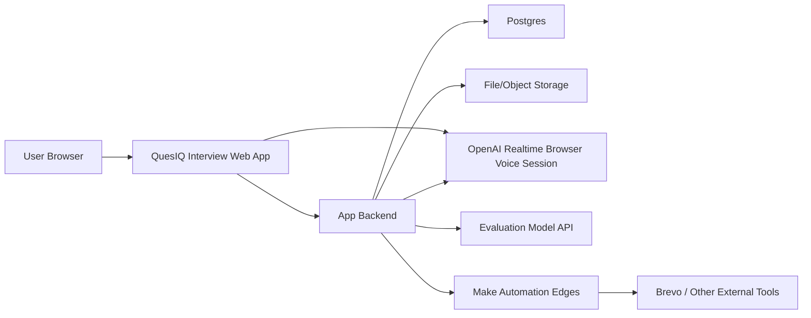

# Architecture

## High-Level System

## Ownership Boundaries

### Our App Owns

- Authentication integration and authorization rules
- User/profile/interview context
- Practice setup flow
- Session records and context snapshots
- Evaluation pipeline
- Progression data
- Stories, job targets, history, settings
- UI design and analytics events

### OpenAI Realtime Owns In The First Voice Beta

- Browser live voice session transport through the Realtime API
- Realtime speech-to-speech model behavior and turn events
- Realtime session events surfaced to our browser/backend integration

### VAPI Is A Fallback

- Keep VAPI available as a fallback voice platform choice if direct Realtime
  exposes a material beta blocker.
- Phone-call/telephony capability is not a current voice requirement.

### Make Owns Only Edges

- Email/contact automation where useful
- Beta feedback and operational workflows
- Existing integrations that are cheaper to keep than to rebuild immediately

## Route Shape

Proposed app routes:

- `/`
- `/login`
- `/signup`
- `/onboarding`
- `/app`
- `/app/practice`
- `/app/practice/session/[sessionId]`
- `/app/sessions/[sessionId]/review`
- `/app/history`
- `/app/stories`
- `/app/me`

Route names can change during implementation. The key decision is that practice
setup and voice session ownership are explicit in the coded app.

## Initial Domain Model

### User/Profile

- id
- auth identity
- email
- display name
- preferred name
- onboarding state
- current target role/company/industry
- current job description
- context summary
- XP, level, streak fields
- rolling stat fields or derived stat summaries

### ResumeAsset

- id
- user id
- storage key/url
- parse status
- extracted text
- derived context metadata

### PracticeMode

- key
- display name
- description
- prompt/config fields
- first message template
- max token/session settings
- setup behavior flags
- active/sort order

### QuestionType

- key
- display name
- guidance
- sort order

### InterviewStyle

- key
- display name
- guidance
- sort order

### Session

- id
- user id
- mode
- selected question type
- selected interview style
- context snapshot
- status
- start/end times
- Realtime call/session correlation id
- transcript artifact
- evaluation status
- user-facing session metadata

### Evaluation

- session id
- five scores
- coaching insight
- feedback/review body
- suggested next mode/action
- raw structured model output
- prompt/config version

### Story

- user id
- trait
- situation
- task
- action
- result
- reflection
- coach notes
- version and practice timestamps

### Progression

- LevelThreshold
- Quest
- UserQuest
- Progress events or enough event data to recompute important state

## Session Lifecycle

1. User completes practice setup.
2. Backend creates a Session with an immutable launch snapshot.
3. Backend authorizes the OpenAI Realtime browser session config.
4. Browser launches the direct Realtime voice session.
5. Frontend shows live session state and graceful end controls.
6. Browser/backend integration captures the required transcript/events/artifacts.
7. Backend stores transcript/session references.
8. Backend runs evaluation.
9. Backend updates session review and progression.
10. User lands on review and dashboard reflects the result.

## Direct Realtime Voice Direction

Use direct OpenAI Realtime for the first coded browser voice beta, backed by our
server for sensitive configuration and session ownership.

The app should avoid exposing:

- private OpenAI API keys
- sensitive prompt templates when a server-mediated design is practical
- user context beyond what the session requires

The first direct Realtime implementation should support:

- dynamic per-session Que prompt/context
- four practice modes
- server-mediated browser session authorization
- start/readiness/end voice UI states
- transcript/event artifact capture needed for evaluation
- recoverable failure states when a voice session or evaluation fails

## Evaluation Direction

Evaluation should be a backend service after the practice session. Store:

- model/provider used
- prompt/config version
- structured evaluation output
- user-facing review text
- progression updates derived from the result

This keeps reviews auditable and lets us improve evaluation prompts over time.

## Deployment Shape

Initial likely deployment:

- Render web service for the app/backend
- Managed Postgres
- Managed object storage
- GitHub-driven deploys

The exact hosting split can change if Next.js deployment needs a different shape,
but the rebuild should keep secrets server-side and maintain preview/local parity.
